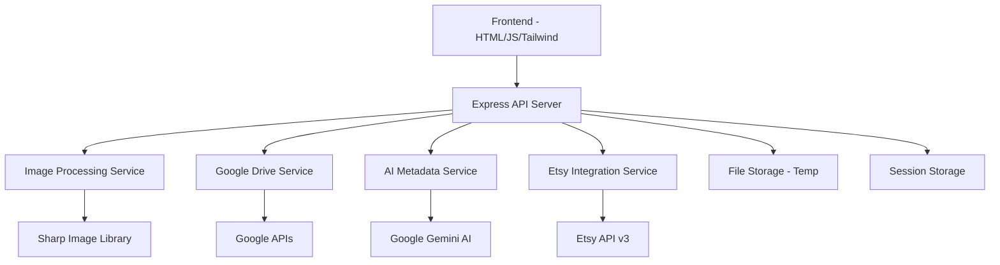
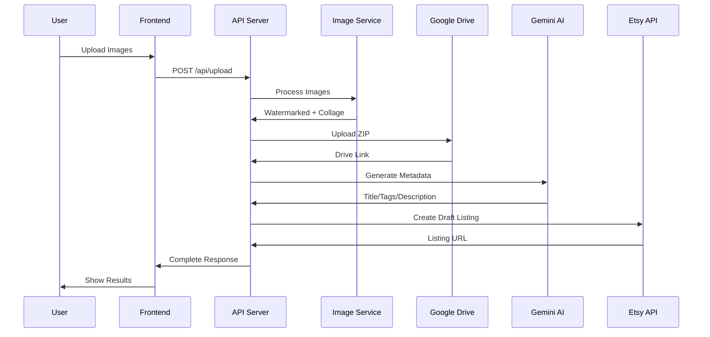

# Design Document

## Overview

The Etsy Listing Management App is a full-stack web application built with Node.js/Express backend and HTML/Vanilla JS frontend. The system processes product images through a multi-stage pipeline: upload validation, watermarking, collage generation, asset packaging, AI metadata generation, and Etsy integration. The architecture emphasizes modularity, error resilience, and secure external API integration.

## Architecture

### High-Level Architecture



### Request Flow



## Components and Interfaces

### Frontend Components

#### Upload Interface
- **File**: `client/index.html`, `client/js/upload.js`
- **Responsibilities**: 
  - Drag-and-drop file upload with preview
  - Client-side file validation (type, size)
  - Progress tracking and status updates
  - Results display with links and metadata preview
- **Key Features**:
  - Multi-file selection with thumbnails
  - Real-time upload progress
  - Error handling and user feedback
  - Responsive design with Tailwind CSS

#### Configuration Panel
- **File**: `client/js/settings.js`
- **Responsibilities**:
  - Watermark customization (text, position, opacity)
  - Collage layout preferences
  - Google Drive folder selection
  - Authentication status display

### Backend Services

#### API Router (`server/routes/api.js`)
- **Endpoints**:
  - `POST /api/upload` - Main processing endpoint
  - `GET /api/auth/google` - Google OAuth initiation
  - `GET /api/auth/etsy` - Etsy OAuth initiation
  - `GET /api/settings` - User preferences
  - `PUT /api/settings` - Update preferences

#### Image Processing Service (`server/services/imageService.js`)
- **Dependencies**: Sharp library for high-performance image processing
- **Methods**:
  - `watermarkImages(images, watermarkConfig)` - Apply watermarks
  - `createCollage(images, layout)` - Generate product collage
  - `optimizeForWeb(image)` - Compress and optimize images
  - `validateImageFiles(files)` - File type and size validation
- **Configuration**: Supports custom watermark text, positioning, and transparency

#### Google Drive Service (`server/services/googleDriveService.js`)
- **Dependencies**: googleapis library
- **Methods**:
  - `authenticateUser()` - OAuth 2.0 flow
  - `uploadZipFile(zipBuffer, filename)` - Upload to designated folder
  - `createShareableLink(fileId)` - Generate public access link
  - `refreshAccessToken()` - Token management
- **Security**: Encrypted token storage, automatic refresh handling

#### AI Metadata Service (`server/services/aiService.js`)
- **Dependencies**: @google/generative-ai (Gemini)
- **Methods**:
  - `generateTitle(imageAnalysis)` - Create compelling titles (≤140 chars)
  - `generateTags(imageContent)` - Extract relevant tags (5-13 tags)
  - `generateDescription(productInfo)` - Write detailed descriptions (200-500 words)
  - `analyzeImages(imageBuffers)` - Extract visual features and context
- **Prompting Strategy**: Optimized prompts for Etsy marketplace requirements

#### Etsy Integration Service (`server/services/etsyService.js`)
- **Dependencies**: etsy-api-v3 or custom wrapper
- **Methods**:
  - `authenticateShop()` - OAuth for shop access
  - `createDraftListing(listingData)` - Create draft with metadata
  - `uploadListingImages(images, listingId)` - Attach processed images
  - `validateListingData(data)` - Ensure Etsy compliance
- **Error Handling**: Graceful fallback with exportable data

#### File Management Service (`server/services/fileService.js`)
- **Methods**:
  - `createTempDirectory()` - Secure temporary storage
  - `packageOriginals(images)` - Create ZIP archive
  - `cleanupTempFiles()` - Automatic cleanup after processing
  - `validateUploadSecurity(files)` - Security scanning

## Data Models

### Image Processing Pipeline

```typescript
interface UploadedImage {
  id: string;
  originalName: string;
  buffer: Buffer;
  mimeType: string;
  size: number;
  dimensions: { width: number; height: number };
}

interface ProcessedAssets {
  watermarkedImages: ProcessedImage[];
  collage: ProcessedImage;
  originalZip: {
    buffer: Buffer;
    filename: string;
    driveLink: string;
  };
}

interface ProcessedImage {
  id: string;
  buffer: Buffer;
  filename: string;
  dimensions: { width: number; height: number };
  optimized: boolean;
}
```

### AI Generated Metadata

```typescript
interface ListingMetadata {
  title: string; // Max 140 characters
  description: string; // 200-500 words
  tags: string[]; // 5-13 tags
  category?: string;
  materials?: string[];
  confidence: number; // AI confidence score
}

interface ImageAnalysis {
  dominantColors: string[];
  detectedObjects: string[];
  style: string;
  mood: string;
  suggestedKeywords: string[];
}
```

### User Configuration

```typescript
interface UserSettings {
  watermark: {
    text: string;
    position: 'bottom-right' | 'bottom-left' | 'center';
    opacity: number; // 0.1 to 1.0
    fontSize: number;
  };
  collage: {
    layout: 'grid' | 'mosaic' | 'featured';
    dimensions: { width: number; height: number };
    spacing: number;
  };
  googleDrive: {
    folderId?: string;
    folderName: string;
  };
  etsy: {
    shopId?: string;
    defaultCategory?: string;
  };
}
```

### API Response Models

```typescript
interface ProcessingResponse {
  success: boolean;
  processingId: string;
  assets: {
    watermarkedImages: string[]; // URLs or base64
    collage: string;
    originalZip: string; // Google Drive link
  };
  metadata: ListingMetadata;
  etsyListing?: {
    draftId: string;
    editUrl: string;
  };
  errors?: ProcessingError[];
}

interface ProcessingError {
  step: string;
  message: string;
  recoverable: boolean;
}
```

## Error Handling

### Client-Side Error Handling
- **File Validation**: Immediate feedback for invalid file types or sizes
- **Network Errors**: Retry mechanisms with exponential backoff
- **Progress Interruption**: Ability to cancel and restart processing
- **User Feedback**: Clear error messages with suggested actions

### Server-Side Error Handling
- **Graceful Degradation**: Continue processing even if some steps fail
- **External API Failures**: Fallback options and manual export capabilities
- **Resource Management**: Automatic cleanup of temporary files and memory
- **Logging**: Comprehensive error logging for debugging and monitoring

### Error Recovery Strategies
- **Google Drive Failure**: Provide ZIP download link as fallback
- **Etsy API Failure**: Export all data for manual listing creation
- **AI Service Failure**: Allow manual metadata entry
- **Image Processing Failure**: Skip problematic images, continue with others

## Testing Strategy

### Unit Testing (Jest)
- **Image Service Tests**: Watermarking, collage generation, optimization
- **API Integration Tests**: Google Drive, Etsy API, Gemini AI mocking
- **Validation Tests**: File type, size, and security validation
- **Error Handling Tests**: Failure scenarios and recovery mechanisms
- **Service Layer Tests**: Individual service method testing with mocked dependencies
- **Utility Function Tests**: Helper functions for file processing and validation

## Deployment Considerations

### Environment Configuration
- **Development**: Local file storage, API mocking capabilities
- **Production**: Cloud storage integration, production API keys
- **Environment Variables**: Secure configuration management
- **Logging**: Structured logging for monitoring and debugging

### Scalability
- **Horizontal Scaling**: Stateless design for multiple server instances
- **File Processing**: Queue-based processing for high-volume scenarios
- **Caching**: Image processing results and AI-generated metadata
- **CDN Integration**: Optimized asset delivery for processed images